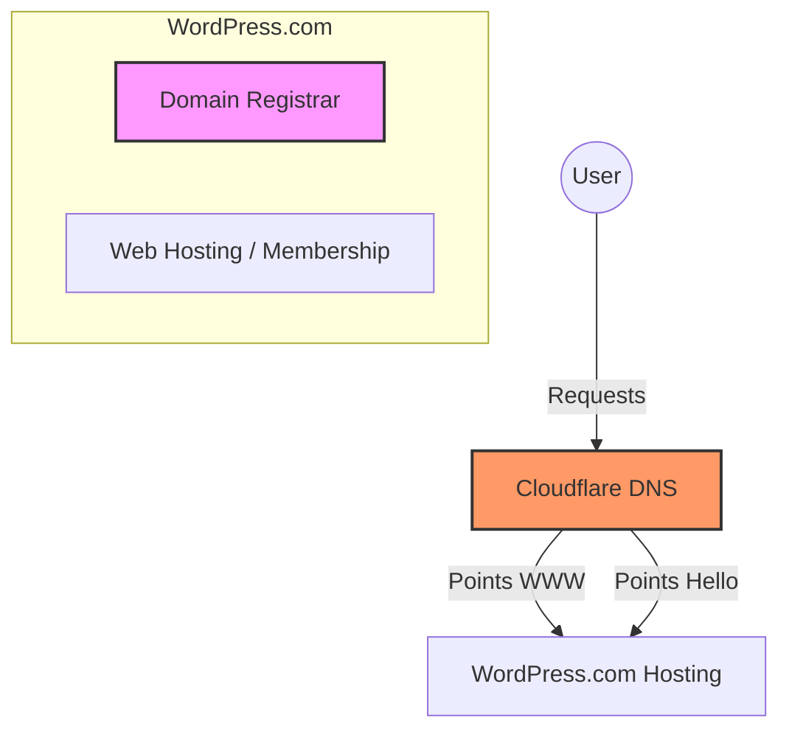
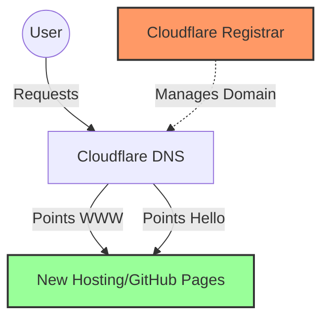

# Runbook: Domain Migration & WordPress Cancellation

This runbook outlines the process for updating domain records for `rifaterdemsahin.com` and canceling the associated WordPress.com membership.

## 1. System Architecture Overview

Currently, the domain infrastructure is split between WordPress.com (Registrar/Hosting) and Cloudflare (DNS Management).

## 2. Phase 1: DNS Updates (Cloudflare)

Since DNS is managed by Cloudflare, you can update where `www` and `hello` point without waiting for the WordPress cancellation.

### Steps:
1.  **Login to Cloudflare Dashboard**.
2.  Select the **rifaterdemsahin.com** zone.
3.  Navigate to the **DNS** section.
4.  **Update `www` record**:
    *   Locate the `A` or `CNAME` record for `www`.
    *   Click **Edit** and change the target to your new hosting IP or CNAME.
    *   Ensure the "Proxy status" (Orange cloud) is toggled as desired.
5.  **Update `hello` record**:
    *   Locate the `A` or `CNAME` record for `hello`.
    *   Update the target to the new destination.
6.  **Verify Propagation**:
    *   Run `dig hello.rifaterdemsahin.com` or use a tool like [whatsmydns.net](https://www.whatsmydns.net/).

## 3. Phase 2: Domain Registrar Transfer (Pre-Cancellation)

**CRITICAL**: If your domain is registered through WordPress.com, you must decide if you want to keep the domain name before canceling the membership.

### Option A: Keep Domain at WordPress.com (Not Recommended if canceling membership)
You can cancel the *hosting* but keep the *domain* registration. However, it's cleaner to move it.

### Option B: Transfer Domain to Cloudflare (Recommended)
1.  In WordPress.com, go to **Upgrades → Domains**.
2.  Select `rifaterdemsahin.com`.
3.  Click **Transfer Domain** → **Transfer to another registrar**.
4.  Disable **Transfer Lock**.
5.  Get the **Auth Code (EPP Code)**.
6.  In Cloudflare, go to **Domain Registration → Transfer Domains** and follow the prompts.

## 4. Phase 3: Cancel WordPress.com Membership

Once your domain is safe (either transferred or set to remain active), you can cancel the subscription.

### Steps:
1.  **Login to WordPress.com**.
2.  Navigate to **Upgrades → Purchases**.
3.  Select the membership/plan you wish to cancel.
4.  Click **Cancel Plan**.
    *   *Note*: If you are within the refund window, it will offer a refund. Otherwise, it will disable auto-renew.
5.  **Confirm Domain Status**: Ensure that "Domain Mapping" or the domain itself isn't deleted if you haven't transferred it yet.

## 5. Future State Diagram

## 6. Verification Checklist

- [ ] `www.rifaterdemsahin.com` points to new target.
- [ ] `hello.rifaterdemsahin.com` points to new target.
- [ ] Domain transfer initiated or domain renewal confirmed outside of WP.
- [ ] WordPress.com subscription status: **Canceled**.
- [ ] Auto-renew disabled for all WordPress.com services.
