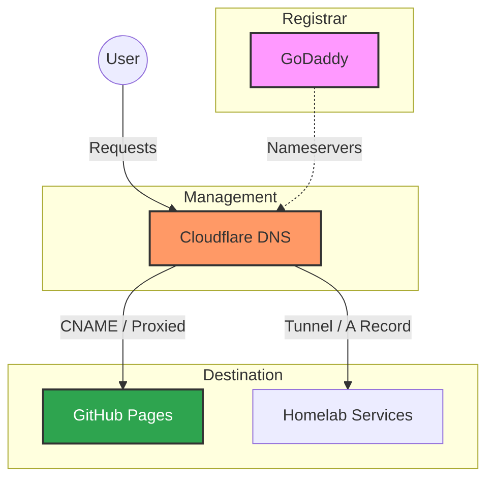

# Runbook: Domain Migration to GitHub Pages & WordPress Cancellation

This runbook outlines the process for updating `rifaterdemsahin.com` to point to GitHub Pages and canceling the legacy WordPress.com membership.

## 1. System Architecture Overview

The domain is registered via **GoDaddy**, managed via **Cloudflare DNS**, and integrated with a **Homelab** environment. The goal is to move the primary web presence to **GitHub Pages**.

## 2. Phase 1: Cloudflare DNS Configuration

Since the registrar is GoDaddy and nameservers point to Cloudflare, all changes happen in the Cloudflare Dashboard.

### Target: GitHub Pages (`rifaterdemsahin.github.io`)

1.  **Update `hello` subdomain**:
    *   Type: `CNAME`
    *   Name: `hello`
    *   Target: `rifaterdemsahin.github.io`
    *   Proxy Status: **Proxied** (Orange Cloud) for SSL/CDN.
2.  **Update `www` subdomain**:
    *   Type: `CNAME`
    *   Name: `www`
    *   Target: `rifaterdemsahin.github.io`
3.  **Update Apex (`@`) Record**:
    *   GitHub requires A records for the root domain:
        *   `185.199.108.153`
        *   `185.199.109.153`
        *   `185.199.110.153`
        *   `185.199.111.153`
    *   *Alternative*: Cloudflare supports "CNAME Flattening" for the apex. You can set `@` to CNAME `rifaterdemsahin.github.io`.

## 3. Phase 2: GitHub Pages Repository Setup

1.  Open your GitHub repository (e.g., `rifaterdemsahin/web`).
2.  Go to **Settings** → **Pages**.
3.  Under **Custom domain**, enter `rifaterdemsahin.com` (or the specific subdomain like `hello.rifaterdemsahin.com`).
4.  Click **Save**.
5.  **Verify DNS**: GitHub will check the records.
6.  Check **Enforce HTTPS** (once the certificate is issued).

## 4. Phase 3: WordPress.com Cancellation

Since the domain is registered at GoDaddy, the WordPress membership is purely for hosting/services and can be canceled without risk to the domain.

### Steps:
1.  **Login to WordPress.com**.
2.  Navigate to **Upgrades → Purchases**.
3.  Select the membership/plan.
4.  Click **Cancel Plan**.
5.  Confirm that you no longer need the WordPress hosting.

## 5. Homelab Integration Note

If you are running services in your homelab using this domain:
*   Ensure **Cloudflare Tunnels** (Cloudflared) or Dynamic DNS (DDNS) records are not overwritten.
*   The `hello` and `www` records should be the only ones redirected to GitHub.

## 6. Verification Checklist

- [ ] `dig hello.rifaterdemsahin.com` returns GitHub IPs or Cloudflare Proxy.
- [ ] `www.rifaterdemsahin.com` redirects/loads GitHub content.
- [ ] GitHub Pages "Custom Domain" status: **DNS check successful**.
- [ ] WordPress.com subscription: **Canceled**.
- [ ] Homelab internal services: **Verified accessible** (if applicable).
