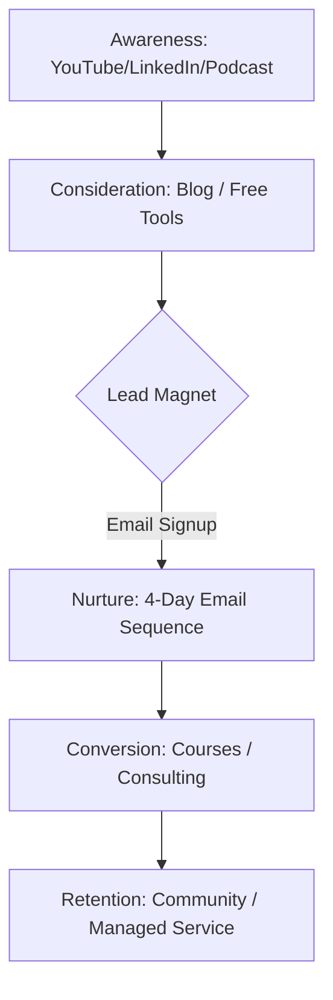

# Website Redesign Strategy 2026

## 1. Navigation Menu Structure

### PRIMARY NAVIGATION (Top Menu)
| Level 1 | Level 2 (Secondary) | CTA / Focus |
| :--- | :--- | :--- |
| **About** | Who I Am, Track Record, Credentials & Philosophy | Brand Authority |
| **Blog** | Latest Posts, By Topic (SRE, DevOps, AI, etc.), Newsletter Signup | SEO & Organic Growth |
| **Content** | Latest Videos, YouTube Playlists, Podcast, All Content | Thought Leadership |
| **Courses** | Coursera Catalog, Udemy Catalog, Free Resources, Custom Enterprise Training | Revenue (Learners) |
| **Services / Hire Me** | Fractional SRE/DevOps Consulting, DeliveryPilot.Net, Case Studies, Pricing & Availability | Revenue (B2B) |
| **Tools** | Github Repos, Published Tools, N8N Workflows, DeliveryPilot Template | Brand Moat |
| **Contact** | Email, LinkedIn, Calendly, Inquiry Form | Lead Gen |

### SECONDARY NAV / UTILITY
- LinkedIn profile link
- GitHub repository link
- **Newsletter Signup** (Accent Button)
- **Book a Call** (Primary CTA Button)

---

## 2. Homepage Redesign Strategy

### Wireframe & Copy Structure

1.  **Navbar**: Clean, minimal logo on left, primary nav centered/right, "Book a Call" CTA in accent color.
2.  **Hero Section**:
    - **Tagline**: "AI-Enhanced Delivery Engineer: Closing Enterprise Skills Gaps."
    - **Sub-headline**: "Bridging the divide between legacy SRE/DevOps and the AI-driven future through high-impact content, courses, and consulting."
    - **Dual CTAs**: `[Watch Content]` (Secondary) | `[Hire Me]` (Primary).
3.  **The Three Pillars (Value Streams)**:
    - **Content Creator**: Sharing insights with 30K+ followers to scale engineering culture.
    - **Course Provider**: 4-year history of shipping professional training on Coursera & Udemy.
    - **SRE Consultant**: SC-cleared expertise for fractional leadership and custom implementations.
4.  **Social Proof (Trust Bar)**: Logos of companies, GitHub stars/repos count, YouTube subscriber stats.
5.  **Content Hub Preview**: Grid layout showing 3 latest YouTube videos and 3 latest Blog posts from the Second Brain.
6.  **Feature Grid (The Moat)**:
    - 40K file Obsidian Vault (Transparency)
    - DeliveryPilot Template (Efficiency)
    - n8n Automations (Speed)
    - Global Delivery Experience (Reliability)
7.  **Lead Magnet Funnel**: "Get the AI-SRE Foundations Checklist" -> Email Capture.
8.  **Testimonials**: Rotating carousel of student reviews and client feedback.
9.  **Footer**: Trust signals (SC Clearance, Nato), full sitemap, social links.

---

## 3. Blog Strategy & Integration

- **Source**: Direct sync from Obsidian Vault (Second Brain).
- **Cadence**: 2 posts per week (1 Original Strategy, 1 Repurposed Video/LinkedIn content).
- **Topics**: AI Implementation, SRE Patterns, Delivery Engineering, Content Creation Workflow.
- **Monetization**: "In-article" bridges (e.g., "Deep dive into this in my Kubernetes Course") + Footer CTAs for consulting.
- **Domain**: Hosted at `/blog/` on the main domain for maximum SEO weight.

---

## 4. Content Marketing Funnel

---

## 5. SEO Action Plan

1.  **Keyword Focus**: "Fractional SRE", "AI Delivery Engineering", "DevOps Skills Gap", "AI-Powered DevOps".
2.  **YouTube Synergy**: Embed videos in blog posts with full transcripts for "long-tail" keyword ranking.
3.  **Internal Linking**: Map "High Traffic" blog posts to "High Value" course pages.
4.  **Schema Markup**: Implement `Person`, `Course`, and `Service` schema for rich snippets.

---

## 6. Implementation Roadmap

- **Week 1**: Update Navbar/Footer across all pages. Launch new About & Hire Me pages.
- **Week 2**: Integrate Blog engine with Obsidian. Set up lead magnet.
- **Week 3**: Launch Email Nurture sequence in Zoho.
- **Month 2**: A/B test hero section CTAs. Expand Service case studies.

---

## 7. Email Nurture Sequence (Zoho)

### Email 1: The Welcome & Value
- **Subject**: Your AI-SRE Foundations Checklist is here
- **Body**: Welcome to the fold. Here is the tool I use to audit enterprise infrastructure...

### Email 2: The Case Study
- **Subject**: How we cut deployment time by 60% (anonymized case study)
- **Body**: Real-world application of the DeliveryPilot framework...

### Email 3: The Educational Upsell
- **Subject**: The #1 skill gap in AI Engineering today
- **Body**: Why most engineers fail at AI integration and how my courses bridge that...

### Email 4: The Discovery Pitch
- **Subject**: Scaling your delivery engineering team?
- **Body**: I have limited capacity for fractional consulting. Let's talk about your roadmap...
